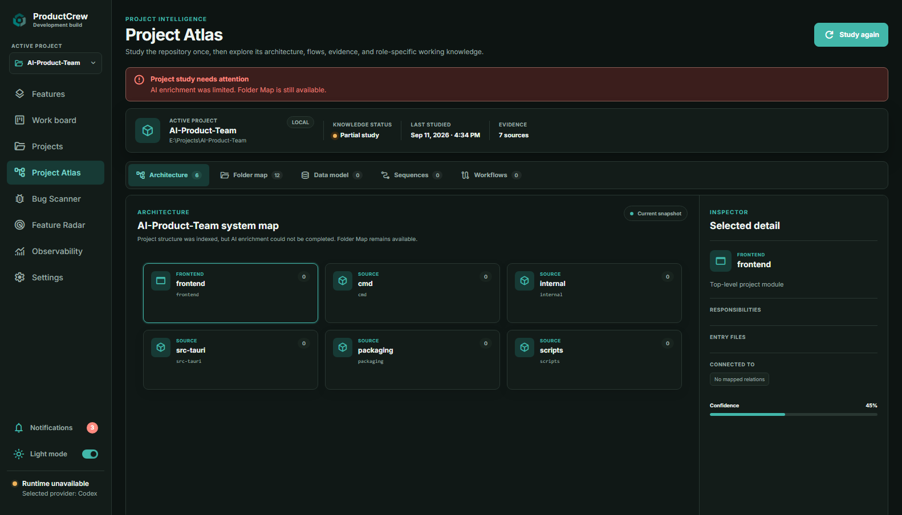
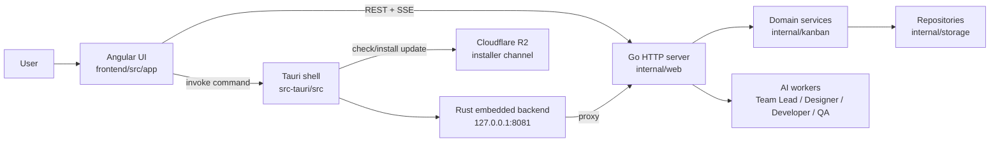
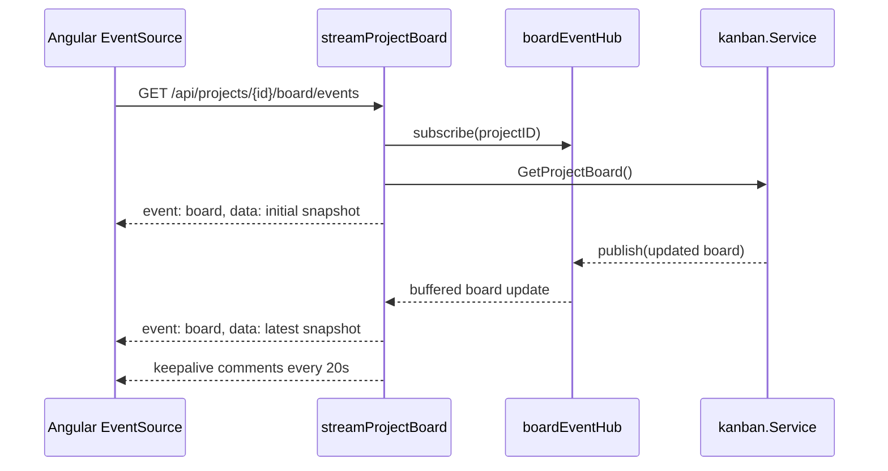
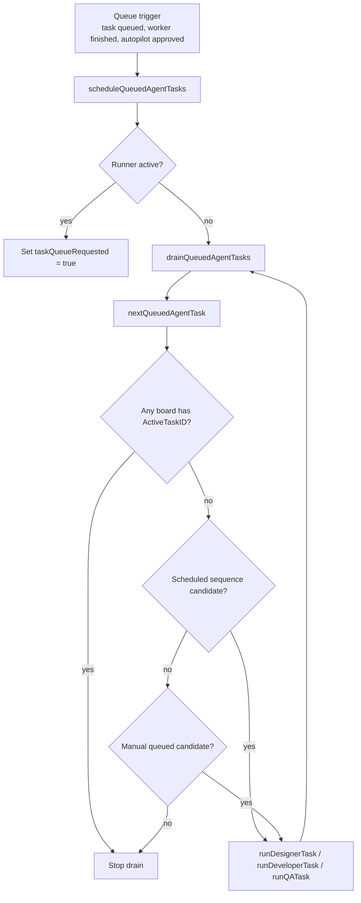
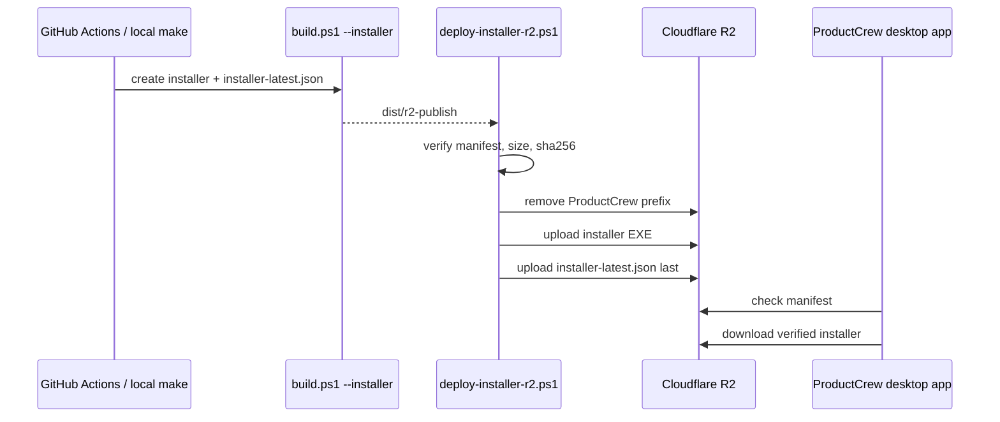
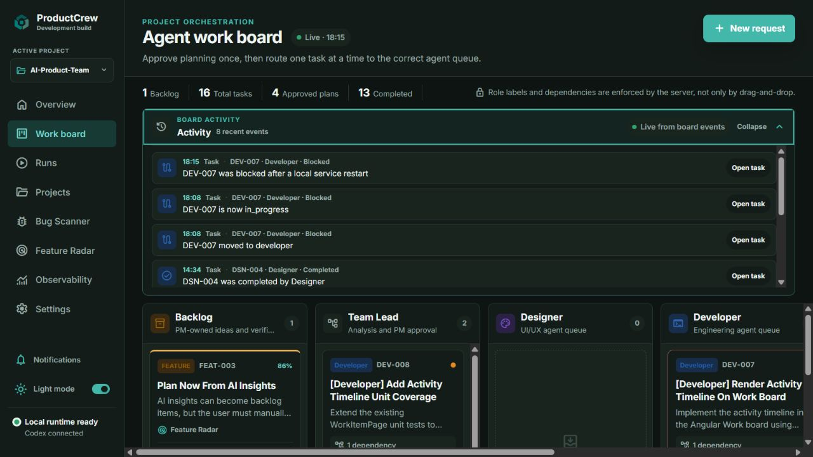
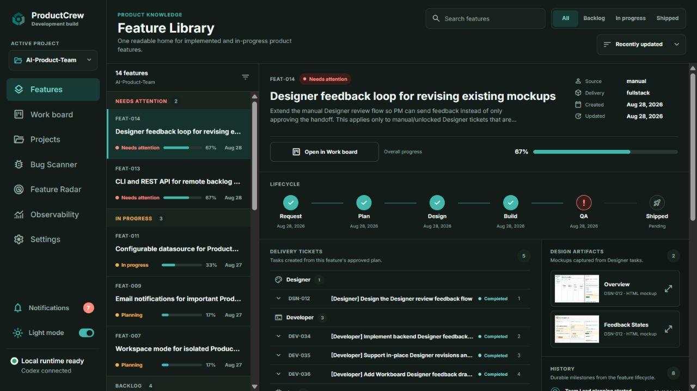

# ProductCrew Code Deep Dive

This note complements [[ProductCrew Learning Hub]]. The learning hub explains the product and architecture at a high level; this file zooms into the code patterns that matter when extending ProductCrew or handing work to another agent.

> Reading rule: each section starts with the mental model, then shows the real code shape from this repository, then explains what to preserve when changing it.



## 1. Runtime Map

ProductCrew is a desktop-first system with a web UI, a Go application server, and a Tauri shell. The desktop build adds native capabilities and a Rust embedded gateway, but most product behavior still lives in Go services and Angular API clients.



Core boundaries:

- `frontend/src/app/core/*`: API clients and desktop bridge clients.
- `internal/web/*`: HTTP routes, SSE streams, orchestration glue, observability, remote automation.
- `internal/kanban/*`: board, backlog, plan, task domain behavior.
- `internal/storage/*`: local JSON and other repository adapters.
- `internal/pccli/*`: CLI wrapper around the remote automation REST API.
- `src-tauri/src/*`: desktop native commands, update installer flow, Rust gateway/proxy.
- `scripts/deploy-installer-r2.ps1`: installer publishing pipeline to R2.

## 2. SSE: Live Board Snapshots

The work board uses Server-Sent Events when the UI needs live snapshots. The backend publishes complete board snapshots; the frontend treats events as a refresh stream, not as a command log.



Backend hub: `internal/web/board_events.go`

```go
type boardEventHub struct {
    mu          sync.Mutex
    subscribers map[string]map[chan kanban.Board]struct{}
}

func (h *boardEventHub) subscribe(projectID string) (<-chan kanban.Board, func()) {
    h.mu.Lock()
    defer h.mu.Unlock()
    updates := make(chan kanban.Board, 4)
    if h.subscribers[projectID] == nil {
        h.subscribers[projectID] = make(map[chan kanban.Board]struct{})
    }
    h.subscribers[projectID][updates] = struct{}{}
    return updates, func() {
        h.mu.Lock()
        defer h.mu.Unlock()
        delete(h.subscribers[projectID], updates)
        if len(h.subscribers[projectID]) == 0 {
            delete(h.subscribers, projectID)
        }
    }
}

func (h *boardEventHub) publish(board kanban.Board) {
    h.mu.Lock()
    defer h.mu.Unlock()
    for updates := range h.subscribers[board.ProjectID] {
        select {
        case updates <- board:
        default:
        }
    }
}
```

Important details:

- The subscriber channel is buffered with size `4`, so short UI/network stalls do not immediately block publishers.
- `publish` uses non-blocking send. If a subscriber is too slow, the update is dropped instead of blocking product state changes.
- Because events can be dropped, events must be snapshots or replaceable state, not irreplaceable mutations.
- `unsubscribe` removes the channel from the project-specific subscriber map and cleans up empty project entries.

HTTP stream: `internal/web/board_handlers.go`

```go
w.Header().Set("Content-Type", "text/event-stream")
w.Header().Set("Cache-Control", "no-cache")
w.Header().Set("Connection", "keep-alive")
writeSSE(w, "board", board)
flusher.Flush()

keepAlive := time.NewTicker(20 * time.Second)
defer keepAlive.Stop()
for {
    select {
    case <-r.Context().Done():
        return
    case board := <-updates:
        writeSSE(w, "board", board)
        flusher.Flush()
    case <-keepAlive.C:
        _, _ = fmt.Fprint(w, ": keepalive\n\n")
        flusher.Flush()
    }
}
```

Frontend client: `frontend/src/app/core/work-item-api.service.ts`

```ts
watchBoardStream(projectId: string): Observable<BoardStreamEvent> {
  return new Observable<BoardStreamEvent>((subscriber) => {
    const source = new EventSource(apiUrl(`${this.boardUrl(projectId)}/events`));
    source.onopen = () => subscriber.next({ state: 'connected' });
    source.addEventListener('board', (event) => {
      subscriber.next({
        state: 'connected',
        board: this.normalizeBoard(JSON.parse((event as MessageEvent<string>).data) as ProjectBoard),
      });
    });
    source.onerror = () => {
      subscriber.next({ state: 'reconnecting' });
    };
    return () => source.close();
  });
}
```

When extending SSE:

- Prefer event names that match the resource being streamed: `board`, `session`, `notification`, `build`, etc.
- Send a complete enough payload that the UI can recover after a dropped intermediate event.
- Always close `EventSource` in Observable teardown.
- Keep REST endpoints available for initial load, refresh, and recovery.

## 3. Queue: Sequential Agent Dispatch

The queue protects a local machine from running many heavyweight agent jobs at once. It scans boards, picks the next runnable queued task, and dispatches to the correct worker.



Single runner guard: `internal/web/task_queue.go`

```go
func (s *server) scheduleQueuedAgentTasks(reason, traceID string) {
    s.taskQueueMu.Lock()
    if s.taskQueueRunning {
        s.taskQueueRequested = true
        s.taskQueueMu.Unlock()
        return
    }
    s.taskQueueRunning = true
    s.taskQueueRequested = false
    s.taskQueueMu.Unlock()

    go s.runQueuedAgentTasks(reason, traceID)
}
```

The runner uses `taskQueueRequested` to avoid spawning many goroutines when several events arrive close together. It finishes one drain pass, checks if another run was requested, then either loops or marks itself idle.

Candidate selection: `internal/web/task_queue.go`

```go
for _, board := range boards {
    if board.ActiveTaskID != "" {
        return queuedAgentTask{}, false
    }
}

if len(sequenceCandidates) > 0 {
    sort.SliceStable(sequenceCandidates, func(left, right int) bool {
        if !sequenceCandidates[left].sequenceScheduledAt.Equal(sequenceCandidates[right].sequenceScheduledAt) {
            return sequenceCandidates[left].sequenceScheduledAt.Before(sequenceCandidates[right].sequenceScheduledAt)
        }
        if sequenceCandidates[left].projectID != sequenceCandidates[right].projectID {
            return sequenceCandidates[left].projectID < sequenceCandidates[right].projectID
        }
        return sequenceCandidates[left].taskID < sequenceCandidates[right].taskID
    })
    return sequenceCandidates[0], true
}
```

Manual queue priority:

```go
sort.SliceStable(manualCandidates, func(left, right int) bool {
    leftRank := agentQueuePriorityRank(manualCandidates[left].priority)
    rightRank := agentQueuePriorityRank(manualCandidates[right].priority)
    if leftRank != rightRank {
        return leftRank < rightRank
    }
    if !manualCandidates[left].queuedAt.Equal(manualCandidates[right].queuedAt) {
        return manualCandidates[left].queuedAt.Before(manualCandidates[right].queuedAt)
    }
    return manualCandidates[left].taskID < manualCandidates[right].taskID
})
```

Key queue knowledge:

- A single active task anywhere blocks dispatch of the next queued task.
- Scheduled plan sequences have priority over manual queue candidates.
- Manual queue candidates sort by priority, then queue timestamp, then task id.
- Dependencies must be complete before dispatch.
- Worker availability is role-specific: Designer, Developer, QA can be absent in tests or degraded runtime modes.
- Safe-stop is represented as board queue control state; `pauseStoppingQueues` transitions queues after the active task finishes.

## 4. REST: Product Contract and Remote Automation

Most UI actions and external automation enter through Go HTTP routes. The same server exposes normal app routes and remote-agent routes.

Route shape: `internal/web/server.go`

```go
s.mux.HandleFunc("GET /api/projects/{projectID}/board", s.getProjectBoard)
s.mux.HandleFunc("GET /api/projects/{projectID}/board/events", s.streamProjectBoard)
s.mux.HandleFunc("POST /api/projects/{projectID}/automation/backlog", s.createBoardBacklogItem)
s.mux.HandleFunc("GET /api/projects/{projectID}/automation/status", s.listRemoteTickets)
s.mux.HandleFunc("GET /api/projects/{projectID}/automation/explore/{ticketRef}", s.getRemoteTicket)
s.mux.HandleFunc("POST /api/projects/{projectID}/automation/autopilot", s.startRemoteAutopilot)
```

Remote automation DTOs: `internal/web/remote_control.go`

```go
const remoteAPIVersion = "v1"

type remoteAutopilotRequest struct {
    ID       string `json:"id"`
    All      bool   `json:"all"`
    Reviewer string `json:"reviewer"`
}

type remoteAutopilotResponse struct {
    APIVersion  string                  `json:"apiVersion"`
    Project     remoteProjectReference  `json:"project"`
    Results     []remoteAutopilotResult `json:"results"`
    RequestedAt time.Time               `json:"requestedAt"`
}
```

Validation pattern:

```go
request.ID = strings.TrimSpace(request.ID)
if request.All == (request.ID != "") {
    writeJSON(w, http.StatusBadRequest, map[string]string{
        "error": "Provide exactly one of id or all=true.",
        "code": "invalid_autopilot_target",
    })
    return
}
```

Autopilot lifecycle:

```go
if item.Status == kanban.BacklogOpen {
    updated, plan, startErr := s.boards.StartBacklogPlanning(ctx, project.ID, item.ID)
    if startErr != nil {
        result.Action, result.State, result.Message, result.Code, result.Error =
            "rejected", "error", "Autopilot could not start planning.", "ticket_not_eligible", startErr.Error()
        return result
    }
    s.boardEvents.publish(updated)
    s.scheduleAutopilotApproval(project, plan.ID, reviewer, traceID)
    go s.runTeamLeadPlanning(updated.ID, project, plan, traceID)
    result.PlanID, result.Action, result.State, result.Message =
        plan.ID, "planning_started", "planning", "Planning started; Autopilot will approve and run the sequence when the plan is ready."
    return result
}
```

Remote automation exists so a non-UI agent can:

- create backlog items,
- list or inspect tickets,
- start one ticket or all eligible tickets in autopilot,
- observe deterministic JSON states.

Preserve these contracts carefully. Cloud agents and CLI automation will usually depend on stable JSON names, error `code` values, and `apiVersion`.

## 5. CLI Bridge: `pc` Is a Thin HTTP Client

The CLI in `internal/pccli` should not duplicate domain logic. It resolves project selection, validates flags, then calls the REST API.

```mermaid
flowchart LR
    Shell[pc autopilot --id TODO-001]
    CLI[internal/pccli.Runner]
    REST[/api/projects/{id}/automation/autopilot]
    Server[remote_control.go]
    Board[kanban board service]

    Shell --> CLI --> REST --> Server --> Board
```

Example: `internal/pccli/run.go`

```go
payload := map[string]any{
    "id": strings.TrimSpace(*id),
    "all": *all,
    "reviewer": strings.TrimSpace(*reviewer),
}
var response json.RawMessage
if err := runner.requestJSON(
    http.MethodPost,
    baseURL+"/api/projects/"+url.PathEscape(selected.ID)+"/automation/autopilot",
    payload,
    &response,
); err != nil {
    return err
}
return runner.writeRawJSON(response)
```

Human-friendly backlog list:

```go
if *list {
    return runner.listAutopilotBacklog(baseURL, selected, *jsonOutput)
}

endpoint := baseURL + "/api/projects/" + url.PathEscape(selected.ID) + "/automation/status?status=backlog"
```

Keep CLI changes boring:

- Add flags only when the REST contract supports them.
- Return server JSON unchanged when possible.
- Keep exit code semantics predictable: validation errors return CLI error, HTTP/API errors return failure.
- Never make the CLI mutate local files directly when the server already owns the state transition.

## 6. IPC: Angular to Tauri Native Commands

ProductCrew has browser-like UI code, but the desktop app can perform native actions through Tauri commands.

Angular side: `frontend/src/app/core/desktop-window.service.ts`

```ts
async openProjectFile(projectId: string, relativePath: string): Promise<void> {
  if (!this.isDesktop) {
    throw new Error('Opening local output files is available in the ProductCrew desktop app.');
  }
  await this.invoke('open_project_file', { projectId, relativePath });
}

private async invoke<T = void>(command: string, args?: Record<string, unknown>): Promise<T> {
  if (!this.isDesktop) return undefined as T;
  const { invoke } = await import('@tauri-apps/api/core');
  return invoke<T>(command, args);
}
```

Rust side: `src-tauri/src/lib.rs`

```rust
#[tauri::command]
async fn open_project_file(project_id: String, relative_path: String) -> Result<(), String> {
    let file_path = imported_project_file(&project_id, &relative_path).await?;
    open_with_default_app(&file_path)
}
```

File safety check:

```rust
fn resolve_project_file(project_path: &Path, relative_path: &str) -> Result<PathBuf, String> {
    let relative = Path::new(relative_path);
    if relative.as_os_str().is_empty()
        || relative.is_absolute()
        || relative.components().any(|component| {
            matches!(component, Component::ParentDir | Component::RootDir | Component::Prefix(_))
        })
    {
        return Err("The file path must be relative to the imported project.".into());
    }

    let project_root = fs::canonicalize(project_path)
        .map_err(|error| format!("Could not resolve the imported project folder: {error}"))?;
    let file_path = fs::canonicalize(project_root.join(relative))
        .map_err(|error| format!("Could not find this output file: {error}"))?;
    if !file_path.starts_with(&project_root) {
        return Err("The output file is outside the imported project.".into());
    }
    Ok(file_path)
}
```

IPC rules to preserve:

- Browser/web mode should not attempt native commands.
- Frontend command names must match Rust `#[tauri::command]` function names.
- Native file commands must validate relative paths and canonicalize before opening or copying.
- Return user-readable errors from Rust because they cross the IPC boundary.

## 7. Desktop Gateway: Rust Proxy to Go Sidecar

The desktop app also starts a Rust embedded backend at `127.0.0.1:8081`. That gateway exposes health and proxies most requests to the legacy Go sidecar at `127.0.0.1:18081`.

`src-tauri/src/backend.rs`

```rust
pub const EMBEDDED_ADDRESS: &str = "127.0.0.1:8081";
pub const LEGACY_GO_ADDRESS: &str = "127.0.0.1:18081";

pub async fn start() -> Result<EmbeddedBackend, Box<dyn std::error::Error>> {
    if is_listening(EMBEDDED_ADDRESS) {
        return Err(format!(
            "ProductCrew embedded backend address {EMBEDDED_ADDRESS} is already in use"
        ).into());
    }

    let listener = TcpListener::bind(EMBEDDED_ADDRESS).await?;
    let state = AppState {
        client: Client::new(),
        legacy_origin: format!("http://{LEGACY_GO_ADDRESS}"),
    };
    let router = Router::new()
        .route("/api/health", get(health))
        .fallback(proxy_legacy)
        .layer(middleware::from_fn(desktop_cors))
        .with_state(state);
}
```

CORS is intentionally narrow:

```rust
fn is_allowed_origin(origin: &HeaderValue) -> bool {
    matches!(
        origin.to_str(),
        Ok("http://tauri.localhost" | "https://tauri.localhost" | "tauri://localhost")
    )
}
```

RDP note:

- I did not find a Remote Desktop Protocol implementation in this codebase.
- The closest "remote control" surfaces are REST automation (`/automation/*`), the CLI bridge (`pc`), and the desktop local gateway.
- If future work really adds RDP-style remote desktop control, it should live as a separate capability with explicit auth and audit boundaries, not mixed into the existing unauthenticated local desktop IPC.

## 8. R2: Installer Publishing and Update Channel

Cloudflare R2 is used as the installer/update distribution bucket. The application consumes an `installer-latest.json` manifest and the installer EXE referenced by that manifest.



Defaults and target: `scripts/deploy-installer-r2.ps1`

```powershell
$r2Endpoint = if ([string]::IsNullOrWhiteSpace($env:R2_ENDPOINT)) {
    'https://8b8d3182a90c830065dcb9563bd9c9f8.r2.cloudflarestorage.com'
} else {
    $env:R2_ENDPOINT
}
$r2Bucket = if ([string]::IsNullOrWhiteSpace($env:R2_BUCKET)) { 'installers' } else { $env:R2_BUCKET }
$r2Prefix = if ([string]::IsNullOrWhiteSpace($env:R2_PREFIX)) { 'ProductCrew' } else { $env:R2_PREFIX.Trim('/') }
```

Safety guard:

```powershell
function Assert-SafeR2Target {
    if ([string]::IsNullOrWhiteSpace($r2Bucket)) {
        throw 'R2_BUCKET cannot be empty.'
    }
    if ([string]::IsNullOrWhiteSpace($r2Prefix) -or $r2Prefix -eq '.' -or $r2Prefix -eq '..') {
        throw 'R2_PREFIX must point to the ProductCrew folder before cleanup can run.'
    }
    if ($r2Prefix -match '(^|/)\.\.($|/)' -or $r2Prefix -match '[\\*?]') {
        throw "Unsafe R2_PREFIX: $r2Prefix"
    }
}
```

Publish order:

```powershell
Invoke-NativeCommand aws 's3' 'rm' "$prefixUri/" '--recursive' '--endpoint-url' $r2Endpoint '--only-show-errors'
Invoke-NativeCommand aws 's3' 'cp' $installerPath "$prefixUri/$installerName" '--endpoint-url' $r2Endpoint '--content-type' 'application/octet-stream' '--no-progress'
Invoke-NativeCommand aws 's3' 'cp' $manifestPath "$prefixUri/installer-latest.json" '--endpoint-url' $r2Endpoint '--content-type' 'application/json' '--cache-control' 'no-cache' '--no-progress'
```

Why the order matters:

- The manifest points to a specific installer filename, size, and SHA-256.
- Uploading the EXE before the manifest avoids a window where clients see a new manifest but the artifact is missing.
- The manifest uses `Cache-Control: no-cache` so desktop update checks do not stay pinned to stale metadata.
- The script restores previous AWS/R2-related environment variables in `finally`, reducing side effects in local shells and CI.

Desktop update commands: `src-tauri/src/updater.rs`

```rust
#[tauri::command]
pub fn check_for_update(update_path: String) -> UpdateStatus {
    #[cfg(feature = "installer-updates")]
    {
        return installer::check(&update_path);
    }
    #[cfg(not(feature = "installer-updates"))]
    {
        UpdateStatus {
            enabled: false,
            state: "disabled".into(),
            current_version: current_version(),
            latest_version: None,
            notes: None,
            message: "Automatic updates are available in the installed ProductCrew edition only.".into(),
        }
    }
}
```

## 9. Persistence: JSON Repository with Recovery Behavior

The board repository is intentionally behind a domain interface so a different adapter can replace local JSON later.

`internal/storage/json_board_repository.go`

```go
// JSONBoardRepository is the initial local persistence adapter. Its public
// behavior is intentionally limited to kanban.BoardRepository so a SQL adapter
// can replace it without changing the domain or HTTP layers.
type JSONBoardRepository struct {
    mu        sync.Mutex
    path      string
    directory string
}
```

Read recovery:

```go
data, err := os.ReadFile(r.path)
if errors.Is(err, os.ErrNotExist) {
    backupPath := r.path + ".bak"
    data, err = os.ReadFile(backupPath)
    if errors.Is(err, os.ErrNotExist) {
        return boardFile{Version: boardFileVersion, Boards: []kanban.Board{}}, nil
    }
    if restoreErr := os.Rename(backupPath, r.path); restoreErr != nil {
        return boardFile{}, fmt.Errorf("restore boards.json backup: %w", restoreErr)
    }
}
```

Write pattern:

```go
temporary, err := os.CreateTemp(r.directory, "boards-*.tmp")
if err != nil {
    return fmt.Errorf("create temporary board file: %w", err)
}
if _, err := temporary.Write(data); err != nil {
    return fmt.Errorf("write temporary board file: %w", err)
}
if err := temporary.Sync(); err != nil {
    return fmt.Errorf("flush temporary board file: %w", err)
}
if err := replaceFile(temporaryPath, r.path); err != nil {
    return fmt.Errorf("replace boards.json: %w", err)
}
```

Windows-aware replacement:

```go
func replaceFile(source, target string) error {
    if err := os.Rename(source, target); err == nil {
        return nil
    }
    backup := target + ".bak"
    _ = os.Remove(backup)
    if err := os.Rename(target, backup); err != nil {
        return err
    }
    if err := os.Rename(source, target); err != nil {
        _ = os.Rename(backup, target)
        return err
    }
    _ = os.Remove(backup)
    return nil
}
```

Persistence rules:

- Lock repository operations with `mu`.
- Normalize nil slices into arrays before exposing data through HTTP.
- Write through a temp file and sync before replacement.
- Keep `.bak` recovery because Windows replace semantics can briefly park the previous file.

## 10. UI Surface Reference

These screenshots are useful when reading code that updates board/activity behavior.





The UI source should be read from the API-client boundary inward:

1. Start at Angular page/component for the interaction.
2. Follow calls into `frontend/src/app/core/*`.
3. Match the HTTP route in `internal/web/server.go`.
4. Read the handler in `internal/web/*`.
5. Follow domain calls into `internal/kanban/*`.
6. Confirm persistence behavior in `internal/storage/*`.

## 11. Extension Checklist

Use this checklist before changing one of the technical surfaces above:

- SSE: Is the event payload recoverable if an update is dropped?
- Queue: Could this start two agent jobs at once or bypass dependency checks?
- REST: Did the JSON field names, error codes, and API version stay stable?
- CLI: Is the CLI still a thin wrapper over server behavior?
- IPC: Are desktop-only commands gated and are paths canonicalized?
- Gateway: Is any new origin, port, or proxy route intentionally allowed?
- R2: Does the manifest still point to an already-uploaded, hash-verified installer?
- Persistence: Are writes atomic enough for Windows and are legacy values normalized?

## 12. High-Signal Files

| Topic | Files |
| --- | --- |
| Board SSE | `internal/web/board_events.go`, `internal/web/board_handlers.go`, `frontend/src/app/core/work-item-api.service.ts` |
| Agent queue | `internal/web/task_queue.go`, `internal/web/*_worker.go`, `internal/web/task_queue_test.go` |
| Remote automation | `internal/web/remote_control.go`, `internal/pccli/run.go`, `docs/remote-control.md` |
| Route registry | `internal/web/server.go` |
| Desktop IPC | `frontend/src/app/core/desktop-window.service.ts`, `src-tauri/src/lib.rs` |
| Desktop gateway | `src-tauri/src/backend.rs` |
| Updates + R2 | `src-tauri/src/updater.rs`, `scripts/deploy-installer-r2.ps1`, `.github/workflows/deploy-installer-r2.yml` |
| Board persistence | `internal/storage/json_board_repository.go` |
