# ProductCrew Learning Hub

> A compact technical lecture for understanding ProductCrew end to end.
> Open this file in Obsidian for Mermaid diagrams, backlinks, and local images.

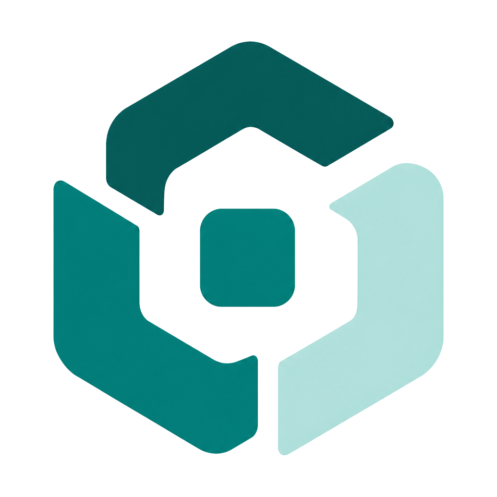

## 1. The One-Minute Mental Model

ProductCrew is a **local-first AI product-team orchestrator**.

Think of it as a desktop workbench where a human operator imports local projects, creates product work, lets AI roles plan/design/implement/verify, and keeps all durable state under local control.

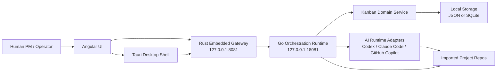

Core idea:

- **Angular** is the operator cockpit.
- **Tauri/Rust** is the native desktop shell and local gateway.
- **Go** owns most orchestration, domain rules, storage, and API behavior.
- **Kanban** is the central domain model.
- **Agents** are replaceable adapters around Codex, Claude Code, and GitHub Copilot.
- **Local data** is the source of truth, not a cloud service.

## 2. Product Shape

ProductCrew turns product work into a controlled sequence:

1. Import or create a project.
2. Add a backlog item or create a product request.
3. Team Lead plans the request.
4. PM approves or denies the plan.
5. Designer, Developer, and QA tasks run in order.
6. Results, artifacts, events, and reports are persisted locally.
7. Remote/cloud agents can later interact through the local REST/CLI automation surface.

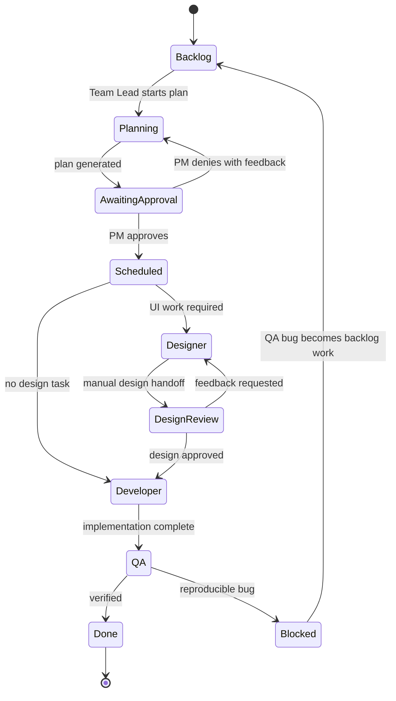

## 3. Repository Map

```text
AI-Product-Team/
├── cmd/
│   ├── main.go                 # Legacy GitHub-oriented orchestrator
│   ├── pc/                     # ProductCrew remote-control CLI
│   └── server/                 # Go local HTTP service entry point
├── docs/
│   ├── remote-control.md       # CLI + REST automation contract
│   └── ProductCrew Learning Hub.md
├── frontend/                   # Angular 21 standalone app
│   ├── src/app/core/           # API clients, models, app services
│   ├── src/app/features/       # Pages: work board, projects, settings, etc.
│   └── src/app/shared/         # Shell and shared UI components
├── internal/
│   ├── kanban/                 # Domain model and state-machine rules
│   ├── web/                    # HTTP API, SSE, workers, settings, project import
│   ├── storage/                # JSON + SQLite repository adapters
│   ├── codex/                  # Codex app-server JSON-RPC client
│   ├── planning/               # Team Lead adapters
│   ├── design/                 # Designer adapters
│   ├── development/            # Developer adapters
│   ├── quality/                # QA adapters
│   ├── observability/          # Durable events and AI session read models
│   ├── notifications/          # Local notification persistence
│   ├── insights/               # Source Scan + Feature Radar persistence
│   ├── buildverify/            # Build command detection and execution
│   ├── deploy/                 # Deploy action detection and execution
│   └── projectartifact/        # Project-local ProductCrew artifacts
├── src-tauri/                  # Tauri desktop shell, Rust gateway, updater
├── scripts/                    # Release/update scripts
├── packaging/                  # Portable package docs
├── design-assets/              # Design specs and reference screenshots
└── Makefile                    # Build, test, CLI, desktop commands
```

## 4. Runtime Architecture

### 4.1 Browser Development Mode

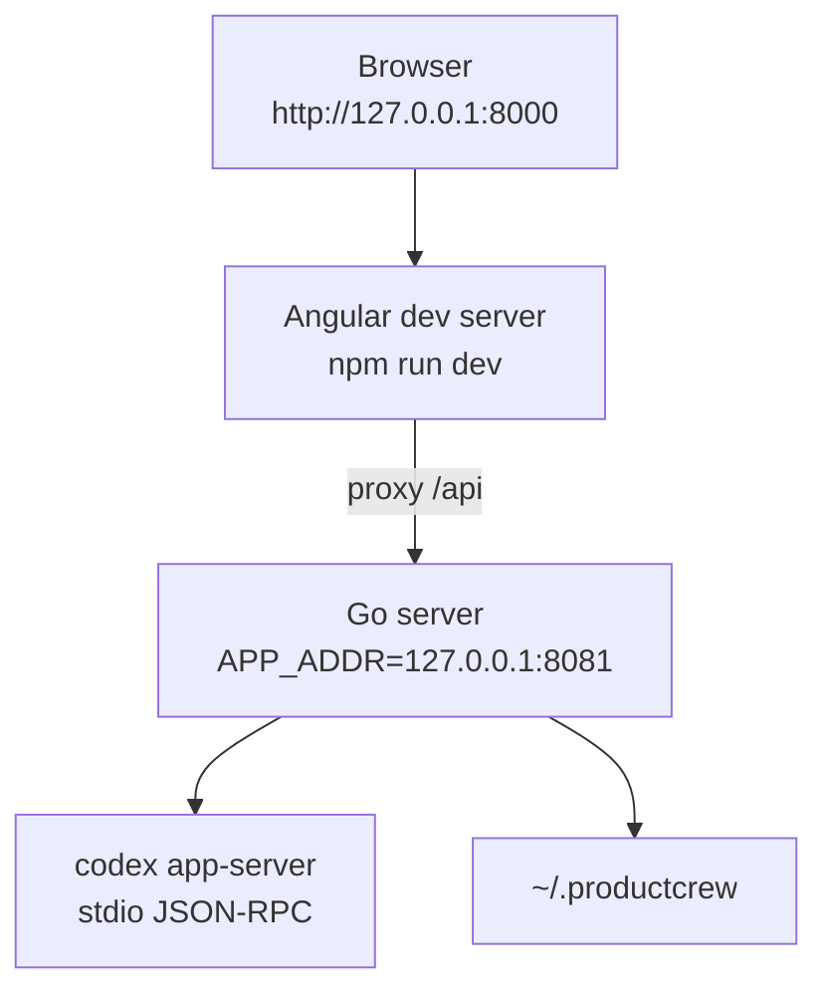

Use this when working on frontend styles and UI flows:

```powershell
cd frontend
npm run dev
```

The Angular dev server proxies API calls to the local backend.

### 4.2 Desktop Production Mode

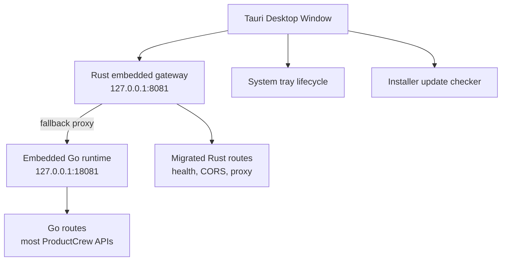

Important desktop behavior:

- Tauri launches and owns the local backend stack.
- Rust listens on `127.0.0.1:8081`.
- Go sidecar listens on `127.0.0.1:18081`.
- Rust proxies unmigrated routes to Go.
- Closing the window hides it to tray when the desktop owns the backend.
- Quit from tray stops backend processes.
- Installer builds can check a local update manifest.

## 5. The Domain Core

The domain lives in `internal/kanban`.

### 5.1 Core Entities

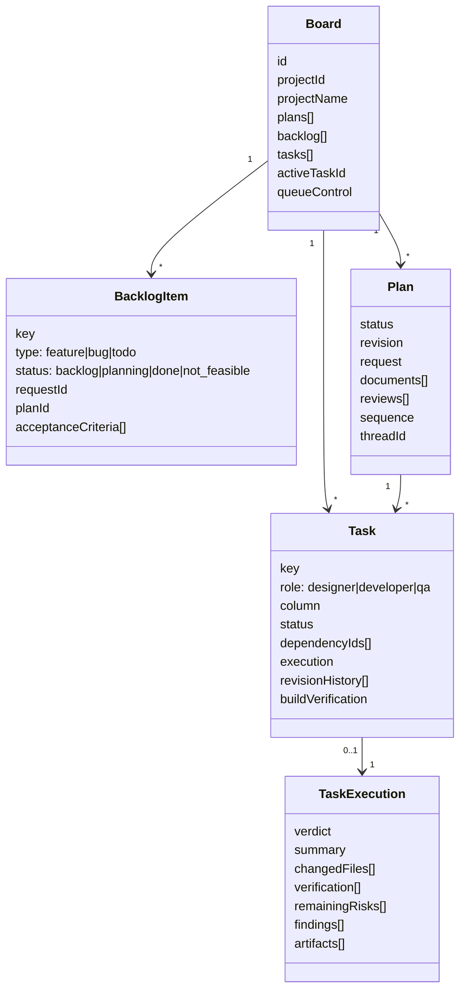

### 5.2 Domain Rules to Remember

ProductCrew's safety comes from strict domain transitions:

- A board belongs to one imported project.
- Backlog items become plans before they become tasks.
- Team Lead creates structured documents and tasks.
- PM approval is required before a plan sequence can run.
- A task has exactly one role: Designer, Developer, or QA.
- A task can only move into the matching role queue.
- Dependencies must complete before downstream tasks run.
- Only one task may be `in_progress` across all project boards.
- Manual Designer work enters `design_review` before Developer starts.
- QA can block work with reproducible findings.
- Interrupted active work is converted into explicit failed/blocked state on restart.

## 6. Storage Architecture

Storage is abstracted through repository interfaces. The domain does not know whether data lives in JSON or SQLite.

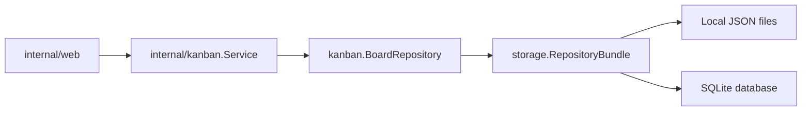

### 6.1 Repository Bundle

`storage.RepositoryBundle` groups durable repositories for:

- Boards
- Insights
- Observability events
- Notifications
- Build profiles
- Deploy profiles
- Git deliveries

Datasource choices:

- `local-json`
- `sqlite`

The selected datasource is bootstrapped from `settings.json`.

### 6.2 Local JSON Datasource

The default local-first mode stores data under:

```text
%USERPROFILE%\.productcrew
```

Typical files:

```text
~/.productcrew/
├── settings.json
├── projects.json
├── boards.json
├── insights.json
├── events.jsonl
├── notifications.json
├── build-profiles.json
├── deploy-profiles.json
└── git-deliveries.json
```

`JSONBoardRepository` is intentionally narrow:

- It implements `kanban.BoardRepository`.
- It writes `boards.json` as a versioned file.
- It normalizes nil arrays to empty arrays for stable API output.
- It writes through a temporary file and replacement path.
- It can restore a `.bak` file left by an interrupted Windows replacement.

### 6.3 Project-Local Artifacts

ProductCrew stores durable user-facing artifacts inside imported repositories:

```text
<project>/.productcrew/
├── requests/<request-id>/
├── insights/<kind>/<run-id>/
├── tasks/<task-id>/
└── design-artifacts/<task-id>/
```

This is history/evidence, not the runtime queue source of truth.

The runtime control plane remains in user-level storage.

## 7. HTTP API Surface

The Go API is registered in `internal/web/server.go`.

Major route families:

```text
/api/health
/api/projects
/api/workspaces
/api/projects/import/*
/api/projects/{projectID}/board/*
/api/projects/{projectID}/automation/*
/api/projects/{projectID}/git/*
/api/projects/{projectID}/build-verification/*
/api/projects/{projectID}/deploy-action/*
/api/source-scans/*
/api/feature-radar/*
/api/observability/*
/api/settings/*
/api/system/*
```

### 7.1 Board API Pattern

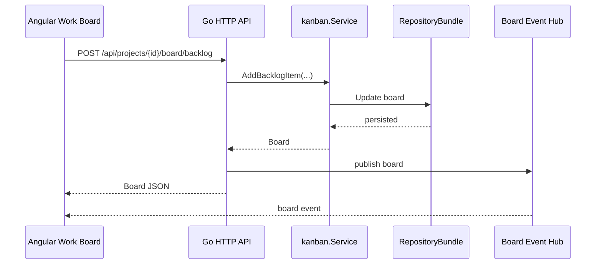

The UI normally:

- Fetches current state via HTTP.
- Subscribes to SSE for live updates.
- Treats the backend as authoritative.

### 7.2 Automation API

Remote/cloud agents should use the automation surface instead of editing storage files.

Documented in `docs/remote-control.md`.

Public routes:

| Method | Route | Purpose |
| --- | --- | --- |
| `GET` | `/api/projects` | Resolve imported projects. |
| `POST` | `/api/projects/{projectID}/automation/backlog` | Create validated backlog work. |
| `GET` | `/api/projects/{projectID}/automation/status` | Read filtered ticket status. |
| `GET` | `/api/projects/{projectID}/automation/explore/{ticketRef}` | Inspect one ticket deeply. |
| `POST` | `/api/projects/{projectID}/automation/autopilot` | Start/attach Autopilot. |

CLI wrapper:

```powershell
make cli
./dist/pc.exe projects list
./dist/pc.exe new --project AI-Product-Team --type todo --title "..." --description "..."
./dist/pc.exe autopilot --project AI-Product-Team --id FEAT-013
./dist/pc.exe status --project AI-Product-Team --status blocked
```

## 8. AI Runtime Architecture

ProductCrew keeps role behavior behind interfaces:

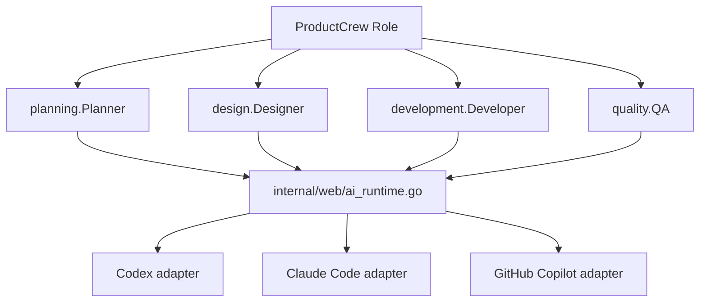

Supported providers:

- `codex`
- `claude-code`
- `github-copilot`

The selected provider and model/effort are read from settings.

If Codex is unavailable and fallback is enabled, ProductCrew can select a fallback CLI provider.

### 8.1 Codex App-Server

`internal/codex` owns one local Codex app-server child process.

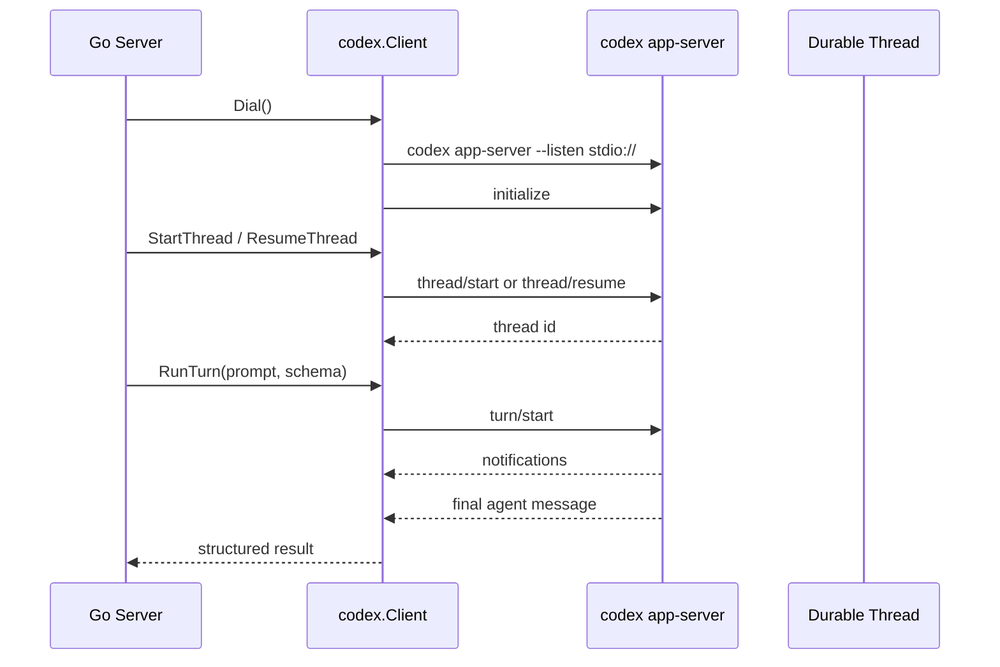

Important details:

- Transport is stdio JSON-RPC.
- Team Lead uses read-only sandbox.
- Developer-like work can use workspace-write semantics through adapters.
- Structured output schemas are used for planning.
- Token usage notifications are collected when providers report them.
- App-server events are normalized into session logs and observability records.

### 8.2 Team Lead Planning

Team Lead flow:

1. Validate request and project path.
2. Start or resume a durable planning thread.
3. Prompt for preflight:
   - `already_implemented`
   - `not_feasible`
   - `needs_work`
4. If work is needed, produce documents and role tasks.
5. Translate output into domain `PlanDraft`.
6. Domain validates references, roles, dependencies, and task shape.

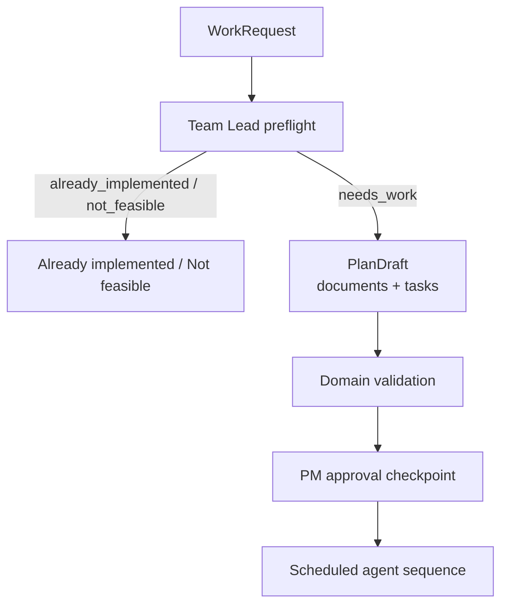

## 9. Agent Roles

### 9.1 Team Lead

Mission:

- Inspect repo.
- Decide whether work is needed.
- Produce implementation-ready documents.
- Create dependency-aware Designer, Developer, QA tasks.

Never:

- Modify code.
- Read secrets.
- Invent filler work.

### 9.2 Designer

Mission:

- Convert approved product scope into UI/UX handoff.
- Produce mockups and design artifacts.
- Reuse current design system.

Artifact target:

```text
.productcrew/design-artifacts/<task-id>/
```

### 9.3 Developer

Mission:

- Implement one approved task.
- Make scoped code changes.
- Report changed files, verification, and risks.
- Repair build failures or Git delivery failures when requested.

### 9.4 QA

Mission:

- Independently verify implementation.
- Produce reproducible findings.
- Block if defects remain.
- Pass when approved scope is verified.

## 10. Frontend Architecture

Angular is a standalone app with lazy-loaded feature pages.

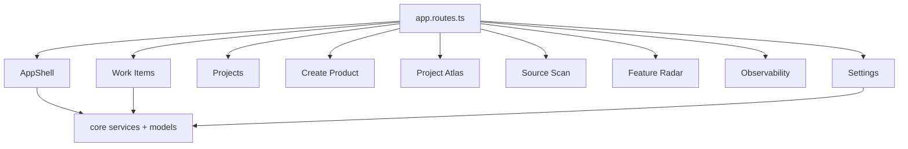

Routes:

| Path | Page |
| --- | --- |
| `/work-items` | Product board, backlog, plans, agent tasks |
| `/features` | Feature library |
| `/projects` | Imported projects |
| `/projects/new` | Product creation |
| `/project-atlas` | Project intelligence/study |
| `/source-scan` | Bug Scanner |
| `/feature-radar` | Feature opportunities |
| `/observability` | Events and AI sessions |
| `/settings` | Runtime, credentials, storage, email, agent profiles |

### 10.1 Core Services

Key Angular services:

- `ProjectApiService`: settings, imports, credentials, build/deploy profiles, workspaces.
- `WorkItemApiService`: board CRUD, plan review, task movement, SSE subscriptions.
- `ProjectContextService`: active project selection.
- `RuntimeHealthService`: `/api/health` polling.
- `NotificationService`: notification fetch + SSE.
- `ThemeService`: light/dark theme.
- `DesktopWindowService`: Tauri-only window commands.
- `AppUpdateService`: installer update checks.

### 10.2 UI State Rule

Frontend normalizes API arrays, but it does not own domain state.

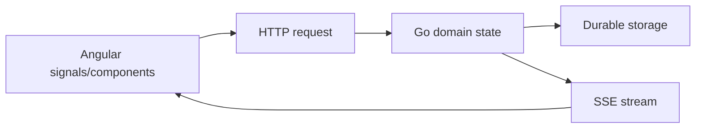

## 11. Observability

Observability is event-first.

`observability.Event` captures:

- level
- category
- name
- message
- correlation id
- project id
- entity type/id
- agent
- stage
- outcome
- duration
- attributes

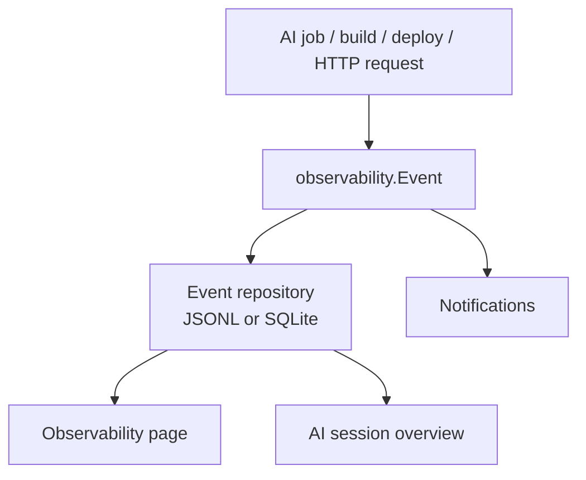

Important semantic boundary:

- Local run/token telemetry is displayed as local telemetry.
- Provider quota percentages must not be invented unless there is a provider-authoritative source.

## 12. Build, Release, and Update

### 12.1 Common Commands

```powershell
# Angular build
cd frontend
npm run build

# Build Angular and copy to Go embed dir
npm run build:go

# Go backend tests
cd ..
go test ./...

# Desktop dev
cd frontend
npm run desktop:dev

# CLI
cd ..
make cli

# Portable release
make

# Installer release
make installer

# All release artifacts
make release
```

### 12.2 Build Pipeline

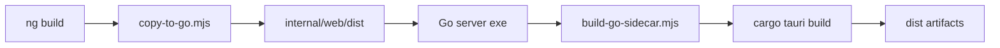

### 12.3 Updater Boundary

Installer updates are available only when built with `installer-updates`.

The updater verifies:

- manifest is readable
- installer path does not escape update folder
- file size matches manifest
- SHA-256 matches manifest
- manifest version is newer than current app version

Portable builds report automatic updates as disabled.

## 13. Safety Boundaries

These boundaries are central to the project:

| Boundary | Rule |
| --- | --- |
| Secrets | PAT and SMTP password go to OS keyring, not JSON settings. |
| Agent access | Agents are instructed not to read secrets or files outside assigned workspace. |
| Storage | Domain writes through repositories, not direct JSON mutation. |
| UI state | Backend is source of truth; UI subscribes to SSE. |
| Desktop lifecycle | Window close hides to tray; explicit Quit stops owned backend. |
| Project artifacts | `.productcrew/` stores history; runtime queue state stays in app data. |
| Automation | Remote agents use REST/CLI, never edit `boards.json` directly. |
| Git delivery | User-linked task branch/commit evidence is explicit, not inferred silently. |

## 14. Feature Areas

### 14.1 Work Board


Primary workflow page for:

- backlog items
- planning requests
- plan review
- task queues
- session logs
- design review
- build verification
- Git delivery references

### 14.2 Project Atlas


Project intelligence studies inspect source and summarize:

- architecture
- folders
- components
- relations
- data entities
- sequences
- workflows
- role guidance

### 14.3 Source Scan

Bug Scanner audits source for actionable findings.

Findings can become backlog bug items and then enter Team Lead planning.

### 14.4 Feature Radar

Feature Radar finds implementable product opportunities based on repository evidence.

### 14.5 Settings

Settings controls:

- Git clone path and credentials
- AI provider/model/effort
- fallback provider
- storage datasource
- backup/restore
- email notifications
- agent role definitions
- global working standard
- agent skills
- update folder

## 15. Extension Points

### Add a New Durable Entity

1. Define a small domain model.
2. Add a repository interface where the domain needs persistence.
3. Add JSON repository.
4. Add SQLite repository if needed.
5. Add it to `storage.RepositoryBundle`.
6. Wire it in `internal/web/server.go`.
7. Add API handlers and Angular service methods.

### Add a New AI Role

1. Create an `internal/<role>` package.
2. Define `Request`, `Result`, and interface.
3. Implement Codex adapter.
4. Implement Claude/Copilot adapters if needed.
5. Add role instructions in settings/project profile.
6. Wire runtime selection in `internal/web/ai_runtime.go`.
7. Add observability events and UI state.

### Add a New Frontend Page

1. Add models in `frontend/src/app/core`.
2. Add API service methods.
3. Create feature page under `frontend/src/app/features`.
4. Add lazy route in `app.routes.ts`.
5. Add sidebar/nav entry in `AppShell`.
6. Add focused tests and build verification.

### Migrate a Go Route to Rust

1. Add Rust route in `src-tauri/src/backend.rs`.
2. Keep route behavior compatible with Go response shape.
3. Let fallback proxy handle all other routes.
4. Add Rust tests.
5. Verify desktop and browser behavior.

## 16. Common Debugging Playbooks

### Backend does not start

Check:

```powershell
$env:APP_ADDR = "127.0.0.1:8081"
go run ./cmd/server
```

Then inspect:

- port `8081`
- Codex CLI availability
- `CODEX_EXECUTABLE`
- `%LOCALAPPDATA%\OpenAI\Codex\bin`
- `~/.productcrew/settings.json`

### UI loads without styles or chunks

Check:

```powershell
cd frontend
npm run build:go
```

Reasoning:

- Go serves embedded Angular assets from `internal/web/dist`.
- `index.html` is `no-store` so old chunk references should revalidate.
- Fingerprinted assets may change after every build.

### Board state looks stale

Check:

- initial `GET /api/projects/{projectID}/board`
- SSE `/events` connection
- `boards.json` or selected SQLite datasource
- browser selected project id
- service restart recovery state

### AI job fails immediately

Check:

- `/api/health`
- selected provider in Settings
- Codex app-server connection
- Claude/GitHub CLI availability
- role instructions load successfully
- project path still exists

### Go tests fail on Windows TempDir cleanup

Some broad async/background tests can outlive temporary directories on Windows. Treat the exact failure carefully:

- If focused package tests pass and only cleanup fails, report it as an environment/test synchronization blocker.
- Do not claim full `go test ./...` pass unless the command exits `0`.
- Redirect caches for Windows runs when needed:

```powershell
New-Item -ItemType Directory -Force .tmp\gocache, .tmp\gotmp, .tmp\gomodcache | Out-Null
$env:GOCACHE = (Resolve-Path .tmp\gocache).Path
$env:GOTMPDIR = (Resolve-Path .tmp\gotmp).Path
$env:GOMODCACHE = (Resolve-Path .tmp\gomodcache).Path
go test ./...
```

## 17. Technical Vocabulary

| Term | Meaning |
| --- | --- |
| Board | One imported project's durable work state. |
| Backlog item | Feature, bug, or todo awaiting planning/completion. |
| Plan | Team Lead's structured response to a request. |
| Document | Plan artifact for Designer/Developer/QA. |
| Task | Role-specific unit of work. |
| Sequence | Approved ordered set of tasks for a plan. |
| Active task | The single task currently running globally. |
| Source Scan | AI bug-finding job. |
| Feature Radar | AI opportunity-finding job. |
| Project Atlas | Repository intelligence/study read model. |
| Agent Studio | Global/project-specific role instructions and skills. |
| RepositoryBundle | Storage adapter bundle selected by datasource settings. |
| Codex app-server | Local JSON-RPC service used for Codex agent threads. |
| Go sidecar | Embedded Go runtime used by desktop production. |
| Rust gateway | Tauri-owned local gateway that proxies to Go and hosts migrated routes. |

## 18. What to Preserve When Changing the Code

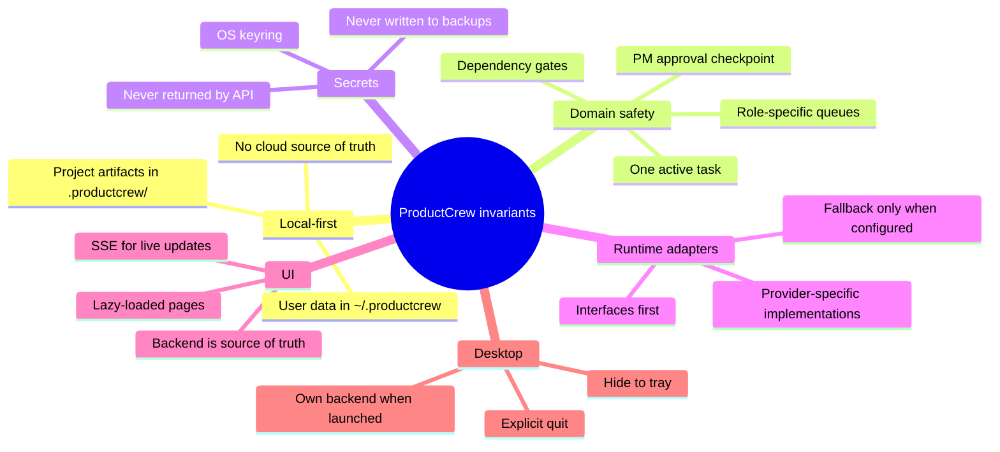

If a change violates one of these invariants, it needs a very explicit reason.

## 19. Suggested Reading Order

For a new engineer or cloud agent:

1. `README.md`
2. `docs/ProductCrew Learning Hub.md`
3. `docs/remote-control.md`
4. `internal/kanban/model.go`
5. `internal/kanban/service.go`
6. `internal/web/server.go`
7. `internal/storage/datasource.go`
8. `internal/web/ai_runtime.go`
9. `internal/codex/appserver.go`
10. `frontend/src/app/app.routes.ts`
11. `frontend/src/app/core/work-item-api.service.ts`
12. `src-tauri/src/lib.rs`
13. `src-tauri/src/backend.rs`

## 20. Quick Architecture Recap

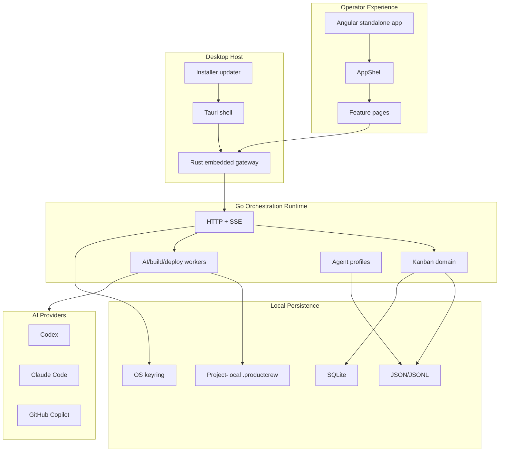

ProductCrew is easiest to understand as:

> A local desktop control plane where the Kanban domain protects workflow integrity, the web API exposes deterministic operations, Angular renders the operator cockpit, and AI providers are swappable workers around a durable local board.
